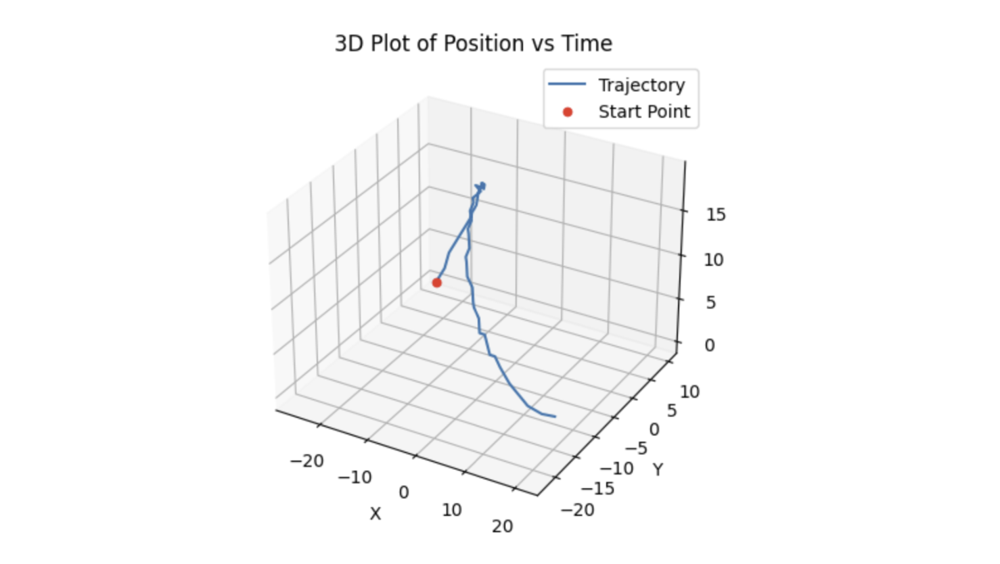

Submarine Tracking via Fourier Filtering

**Author:** Kutay Demiralay  
**Department of Aeronautics and Astronautics, University of Washington, Seattle, WA**

## Overview

This project processes 4D acoustic pressure data to track the position of a submarine in Puget Sound. The original data is a `(262144, 49)` array, reshaped into a 4D dataset of shape `(64, 64, 64, 49)` to represent a 3D spatial cube evolving over 49 time steps (each 30 minutes apart). The data is noisy, and the goal is to extract the submarine’s trajectory using Fourier transform and Gaussian filtering.

## Theoretical Background

The Fourier Transform (FT) converts a spatial or time-domain signal into the frequency domain. The central frequency of the submarine signal is extracted by averaging the FT across all time steps. A 3D Gaussian filter centered at this frequency is used to suppress noise. The Inverse Fourier Transform (IFT) is then applied to reconstruct denoised spatial data, and the maximum energy location at each time step is tracked as the submarine position.

## Algorithm Implementation

### Step 1: Find Central Frequency

- Reshape the raw pressure signal into 3D volumes for each time step.
- Apply `np.fft.fftn` and `np.fft.fftshift` to each volume.
- Average the frequency spectra and find the index of the maximum amplitude.

### Step 2: Create 3D Gaussian Filter

- Build a Gaussian filter centered at the identified frequency index.
- Use standard deviation sigma = 3.
- The filter is computed over all 3 dimensions of the frequency domain.

### Step 3: Apply Filter and Track Position

- Multiply each frequency-domain volume by the Gaussian filter.
- Apply `np.fft.ifftn` and `np.fft.ifftshift` to obtain filtered spatial data.
- Extract the index of the maximum value at each time step to get the submarine's estimated position.

### Step 4: Visualization

- Plot Gaussian filter slices, filtered vs. raw data slices, position-time plots, and a 3D trajectory of the submarine.

## Figures

**Figure 1:** Visualization of Gaussian Filter X-Slice at X=32 in Frequency Domain  

**Figure 2:** Original vs. Filtered Data in Time Domain at Z=32  

**Figure 3:** Position in X, Y, Z Dimensions vs. Time (Raw vs. Filtered)  

**Figure 4:** 3D Trajectory of Submarine Over 24 Hours  

## Conclusion

The submarine trajectory was successfully reconstructed over a 24-hour period by filtering noisy data with a Gaussian function in the frequency domain. Although some noise remains, the method demonstrates a clear improvement in tracking performance. Future work could involve reducing the time interval between measurements or using interpolation to generate smoother trajectories.

## Full Report

The full PDF report is available in the repository: [report1.pdf](./report1.pdf)

## Acknowledgements

Thanks to Po, Shavey, and Emoji for helpful discussions. Special thanks to Professor Eli for lectures, office hours, and code guidance.
